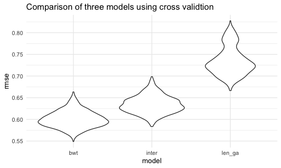

Homework 6
================
Ziyan Xu
12/01/2022

-   <a href="#problem-2" id="toc-problem-2">Problem 2</a>
-   <a href="#problem-3" id="toc-problem-3">Problem 3</a>

This is my solution to HW6.

## Problem 2

``` r
homicide_df = 
  read_csv("https://raw.githubusercontent.com/washingtonpost/data-homicides/master/homicide-data.csv", na = c("", "NA", "Unknown")) %>% 
  mutate(
    city_state = str_c(city, state, sep = ", "),
    victim_age = as.numeric(victim_age),
    resolution = case_when(
      disposition == "Closed without arrest" ~ 0,
      disposition == "Open/No arrest"        ~ 0,
      disposition == "Closed by arrest"      ~ 1)
  ) %>% 
  filter(
    victim_race %in% c("White", "Black"),
    city_state != "Tulsa, AL") %>% 
  select(city_state, resolution, victim_age, victim_race, victim_sex)
```

Start with Baltimore, MD.

``` r
baltimore_df =
  homicide_df %>% 
  filter(city_state == "Baltimore, MD")

glm(resolution ~ victim_age + victim_race + victim_sex, 
    data = baltimore_df,
    family = binomial()) %>% 
  broom::tidy() %>% 
  mutate(
    OR = exp(estimate), 
    CI_lower = exp(estimate - 1.96 * std.error),
    CI_upper = exp(estimate + 1.96 * std.error),
    p_val = rstatix::p_format(p.value, digits = 2)) %>% 
  select(term, OR, CI_lower,CI_upper, p_val) %>% 
  mutate(term = str_replace(term, "victim_age", "Victim age"),
         term = str_replace(term, "victim_race", "Victim Race: "),
         term = str_replace(term, "victim_sex", "Victim Sex: ")) %>% 
  knitr::kable(digits = 3, align = "lccc", 
               col.names = c("Term", "Estimated adjusted OR", "CI lower bound", "CI upper bound", "p-value"))
```

| Term               | Estimated adjusted OR | CI lower bound | CI upper bound | p-value  |
|:-------------------|:---------------------:|:--------------:|:--------------:|:---------|
| (Intercept)        |         1.363         |     0.975      |     1.907      | 0.07     |
| Victim age         |         0.993         |     0.987      |     1.000      | 0.043    |
| Victim Race: White |         2.320         |     1.648      |     3.268      | \<0.0001 |
| Victim Sex: Male   |         0.426         |     0.325      |     0.558      | \<0.0001 |

For the city of Baltimore, MD, the homicides whose victim is male are
significantly less like to be resolved than those whose victim is
female.

Try this across cities.

``` r
models_results_df = 
  homicide_df %>% 
  nest(data = -city_state) %>% 
  mutate(
    models = 
      map(.x = data, ~glm(resolution ~ victim_age + victim_race + victim_sex, data = .x, family = binomial())),
    results = map(models, broom::tidy)
  ) %>% 
  select(city_state, results) %>% 
  unnest(results) %>% 
  mutate(
    OR = exp(estimate),
    CI_lower = exp(estimate - 1.96 * std.error),
    CI_upper = exp(estimate + 1.96 * std.error),
    p_val = rstatix::p_format(p.value, digits = 2)
  ) %>% 
  filter(term == "victim_sexMale") %>% 
  select(city_state, OR, CI_lower,CI_upper, p_val) 

models_results_df %>% 
  knitr::kable(digits = 3, align = "llccc", col.names = c("City", "Estimated adjusted OR", "CI lower bound", "CI upper bound", "p-value"))
```

| City               | Estimated adjusted OR | CI lower bound | CI upper bound | p-value  |
|:-------------------|:----------------------|:--------------:|:--------------:|:--------:|
| Albuquerque, NM    | 1.767                 |     0.831      |     3.761      |  0.1393  |
| Atlanta, GA        | 1.000                 |     0.684      |     1.463      | 0.99968  |
| Baltimore, MD      | 0.426                 |     0.325      |     0.558      | \<0.0001 |
| Baton Rouge, LA    | 0.381                 |     0.209      |     0.695      | 0.00165  |
| Birmingham, AL     | 0.870                 |     0.574      |     1.318      | 0.51115  |
| Boston, MA         | 0.667                 |     0.354      |     1.260      | 0.21213  |
| Buffalo, NY        | 0.521                 |     0.290      |     0.935      | 0.02895  |
| Charlotte, NC      | 0.884                 |     0.557      |     1.403      | 0.60041  |
| Chicago, IL        | 0.410                 |     0.336      |     0.501      | \<0.0001 |
| Cincinnati, OH     | 0.400                 |     0.236      |     0.677      | 0.00065  |
| Columbus, OH       | 0.532                 |     0.378      |     0.750      |  0.0003  |
| Denver, CO         | 0.479                 |     0.236      |     0.971      |  0.0411  |
| Detroit, MI        | 0.582                 |     0.462      |     0.734      | \<0.0001 |
| Durham, NC         | 0.812                 |     0.392      |     1.683      | 0.57611  |
| Fort Worth, TX     | 0.669                 |     0.397      |     1.127      | 0.13117  |
| Fresno, CA         | 1.335                 |     0.580      |     3.071      | 0.49638  |
| Houston, TX        | 0.711                 |     0.558      |     0.907      | 0.00593  |
| Indianapolis, IN   | 0.919                 |     0.679      |     1.242      | 0.58189  |
| Jacksonville, FL   | 0.720                 |     0.537      |     0.966      | 0.02832  |
| Las Vegas, NV      | 0.837                 |     0.608      |     1.154      | 0.27761  |
| Long Beach, CA     | 0.410                 |     0.156      |     1.082      | 0.07176  |
| Los Angeles, CA    | 0.662                 |     0.458      |     0.956      | 0.02793  |
| Louisville, KY     | 0.491                 |     0.305      |     0.790      | 0.00337  |
| Memphis, TN        | 0.723                 |     0.529      |     0.988      | 0.04205  |
| Miami, FL          | 0.515                 |     0.304      |     0.872      | 0.01348  |
| Milwaukee, wI      | 0.727                 |     0.499      |     1.060      | 0.09767  |
| Minneapolis, MN    | 0.947                 |     0.478      |     1.875      | 0.87573  |
| Nashville, TN      | 1.034                 |     0.685      |     1.562      | 0.87289  |
| New Orleans, LA    | 0.585                 |     0.422      |     0.811      | 0.00131  |
| New York, NY       | 0.262                 |     0.138      |     0.499      | \<0.0001 |
| Oakland, CA        | 0.563                 |     0.365      |     0.868      | 0.00937  |
| Oklahoma City, OK  | 0.974                 |     0.624      |     1.520      | 0.90794  |
| Omaha, NE          | 0.382                 |     0.203      |     0.721      | 0.00295  |
| Philadelphia, PA   | 0.496                 |     0.378      |     0.652      | \<0.0001 |
| Pittsburgh, PA     | 0.431                 |     0.265      |     0.700      | 0.00067  |
| Richmond, VA       | 1.006                 |     0.498      |     2.033      | 0.98658  |
| San Antonio, TX    | 0.705                 |     0.398      |     1.249      | 0.23034  |
| Sacramento, CA     | 0.669                 |     0.335      |     1.337      | 0.25481  |
| Savannah, GA       | 0.867                 |     0.422      |     1.780      | 0.69735  |
| San Bernardino, CA | 0.500                 |     0.171      |     1.462      | 0.20567  |
| San Diego, CA      | 0.413                 |     0.200      |     0.855      | 0.01722  |
| San Francisco, CA  | 0.608                 |     0.317      |     1.165      | 0.13362  |
| St. Louis, MO      | 0.703                 |     0.530      |     0.932      | 0.01439  |
| Stockton, CA       | 1.352                 |     0.621      |     2.942      | 0.44745  |
| Tampa, FL          | 0.808                 |     0.348      |     1.876      | 0.61939  |
| Tulsa, OK          | 0.976                 |     0.614      |     1.552      | 0.91746  |
| Washington, DC     | 0.691                 |     0.469      |     1.018      | 0.06167  |

Make a plot of estimated ORs and CIs for each city.

``` r
models_results_df %>% 
  mutate(city_state = fct_reorder(city_state, OR)) %>% 
  ggplot(aes(x = city_state, y = OR)) + 
  geom_point() + 
  geom_errorbar(aes(ymin = CI_lower, ymax = CI_upper)) + 
  theme(axis.text.x = element_text(angle = 90, hjust = 1)) +
  labs(x = "City", y = "Estimated OR with CI")
```


The plot shows that odds ratios are lower than 1 in most cities,
indicating that it is less often for homicides in which the victim is
male to be resolved by arrest.

## Problem 3

-   Tidy dataset.

I convert numeric variables (‘babysex’, ‘frace’, ‘malform’, ‘mrace’) to
factor and change the unit of ‘bwt’ (from grams to pounds) and ‘mheight’
(from inches to centimeters). There are no NAs in the dataset, but
values of ‘pnumlbw’ and ‘pnumgsa’ are all zero. It indicates that these
variables may have minimal influences to baby birthweight in this case,
thus I excluded them.

``` r
baby_df = 
  read_csv("./data/birthweight.csv") %>% 
  janitor::clean_names() %>%
  mutate(
    babysex = factor(case_when(
      babysex == 1 ~ "male", babysex == 2 ~ "female")),
    frace = factor(case_when(
      frace == 1 ~ "White", frace == 2 ~ "Black", 
      frace == 3 ~ "Asian", frace == 4 ~ "Puerto Rican",
      frace == 8 ~ "Other", frace == 9 ~ "Unknown"
      )),
    malform = factor(case_when(
      malform == 0 ~ "absent", malform == 1 ~ "present"
    )),
    mrace = factor(case_when(
      mrace == 1 ~ "White", mrace == 2 ~ "Black",
      mrace == 3 ~ "Asian", mrace == 4 ~ "Puerto Rican",
      mrace == 8 ~ "Other"
      )),
    bwt = bwt * 0.00220462262,
    mheight = mheight * 2.54
    ) %>% 
  drop_na() %>% 
  select(-pnumlbw, -pnumsga) %>% 
  select(bwt, everything())
```

-   Fit a regression model.

Firstly, fit a model with all predictors and select variables with
p-value less than 0.05 in the anova result.

``` r
model_all = lm(bwt ~ ., data = baby_df)

anova(model_all) %>% 
  broom::tidy() %>% 
  filter(p.value < 0.05) %>% 
  select(term, p.value) %>% 
  knitr::kable()
```

| term    |   p.value |
|:--------|----------:|
| babysex | 0.0000000 |
| bhead   | 0.0000000 |
| blength | 0.0000000 |
| delwt   | 0.0000000 |
| fincome | 0.0000000 |
| frace   | 0.0000000 |
| gaweeks | 0.0000000 |
| mheight | 0.0072562 |
| mrace   | 0.0268794 |
| parity  | 0.0098053 |
| ppbmi   | 0.0000000 |
| smoken  | 0.0000000 |

Then, create a correlation matrix with numeric variables. The plot shows
that parity seems to have weaker correlation with bwt than others, thus
excluded for baseline variables. What’s more, there are error with
‘wtgain’ when generating regression model, which maybe caused by
collinearity (‘delwt’ = ‘wtgain’ + ‘ppwt’).

``` r
cor(baby_df[,c(3, 4, 5, 6, 8, 11, 14, 15, 17)]) %>% 
  corrplot(method = "circle", type = "upper", diag = FALSE)
```


``` r
model_bwt = lm(bwt ~ babysex + bhead + blength + delwt + fincome + gaweeks + mheight + mrace + ppbmi + smoken, data = baby_df)

model_bwt %>% 
  broom::tidy() %>% 
  knitr::kable(digits = 3)
```

| term              | estimate | std.error | statistic | p.value |
|:------------------|---------:|----------:|----------:|--------:|
| (Intercept)       |  -12.091 |     0.388 |   -31.190 |   0.000 |
| babysexmale       |   -0.064 |     0.019 |    -3.431 |   0.001 |
| bhead             |    0.289 |     0.008 |    38.014 |   0.000 |
| blength           |    0.165 |     0.004 |    37.082 |   0.000 |
| delwt             |    0.009 |     0.001 |    10.443 |   0.000 |
| fincome           |    0.001 |     0.000 |     1.787 |   0.074 |
| gaweeks           |    0.025 |     0.003 |     7.769 |   0.000 |
| mheight           |   -0.003 |     0.002 |    -1.679 |   0.093 |
| mraceBlack        |   -0.136 |     0.093 |    -1.459 |   0.145 |
| mracePuerto Rican |   -0.055 |     0.100 |    -0.552 |   0.581 |
| mraceWhite        |    0.170 |     0.093 |     1.821 |   0.069 |
| ppbmi             |   -0.033 |     0.005 |    -6.172 |   0.000 |
| smoken            |   -0.011 |     0.001 |    -8.279 |   0.000 |

Make a plot of model residuals against predicted values.

``` r
baby_df %>% 
  add_residuals(model_bwt) %>% 
  add_predictions(model_bwt) %>% 
  ggplot(aes(x = pred, y = resid)) + 
  geom_point(alpha = 0.5) +
  geom_smooth(method = "lm", color = "red") +
  labs(title = "Relationship between predicted values and residuals", 
       x = "Predicted values", 
       y = "Residuals")
```


The plot shows that residual values are distributed around 0 and form a
horizontal (linear) ‘band’ around zero, though there are several
outliers.

-   Fit a model using length at birth and gestational age as predictors,
    and another model using head circumference, length, sex, and all
    interactions between them.

``` r
model_len_ga = lm(bwt ~ blength + gaweeks, data = baby_df)

model_len_ga %>% 
  broom::tidy() %>% 
  knitr::kable(digits = 3)
```

| term        | estimate | std.error | statistic | p.value |
|:------------|---------:|----------:|----------:|--------:|
| (Intercept) |   -9.585 |     0.216 |   -44.383 |       0 |
| blength     |    0.283 |     0.004 |    64.604 |       0 |
| gaweeks     |    0.060 |     0.004 |    15.744 |       0 |

``` r
model_inter = lm(bwt ~ bhead * blength * babysex, data = baby_df)

model_inter %>% 
  broom::tidy() %>% 
  knitr::kable(digits = 3)
```

| term                      | estimate | std.error | statistic | p.value |
|:--------------------------|---------:|----------:|----------:|--------:|
| (Intercept)               |   -1.768 |     2.430 |    -0.728 |   0.467 |
| bhead                     |   -0.037 |     0.075 |    -0.487 |   0.626 |
| blength                   |   -0.048 |     0.052 |    -0.926 |   0.354 |
| babysexmale               |  -14.054 |     3.699 |    -3.800 |   0.000 |
| bhead:blength             |    0.007 |     0.002 |     4.666 |   0.000 |
| bhead:babysexmale         |    0.437 |     0.113 |     3.883 |   0.000 |
| blength:babysexmale       |    0.273 |     0.077 |     3.524 |   0.000 |
| bhead:blength:babysexmale |   -0.009 |     0.002 |    -3.670 |   0.000 |

-   Compare the above 3 model using cross validation.

``` r
cv_df =
  crossv_mc(baby_df, 1000) %>% 
  mutate(
    train = map(train, as_tibble),
    test = map(test, as_tibble))

cv_df = 
  cv_df %>% 
  mutate(
    bwt_mod = map(.x = train, ~lm(bwt ~ babysex + bhead + blength + delwt + fincome + gaweeks + mheight + mrace + ppbmi + smoken, data = baby_df)),
    len_ga_mod = map(.x = train, ~lm(bwt ~ blength + gaweeks, data = baby_df)),
    inter_mod = map(.x = train, ~lm(bwt ~ bhead * blength * babysex, data = baby_df))) %>% 
  mutate(
    rmse_bwt = map2_dbl(bwt_mod, .y = test, ~rmse(model = .x, data = .y)),
    rmse_len_ga = map2_dbl(len_ga_mod, .y = test, ~rmse(model = .x, data = .y)),
    rmse_inter = map2_dbl(inter_mod, .y = test, ~rmse(model = .x, data = .y)))
```

Make a plot of rmse of 3 models.

``` r
cv_df %>% 
  select(starts_with("rmse")) %>% 
  pivot_longer(
    everything(),
    names_to = "model", 
    values_to = "rmse",
    names_prefix = "rmse_") %>% 
  ggplot(aes(x = model, y = rmse)) + 
  geom_violin() +
  labs(
    title = "Comparison of three models using cross validtion"
    )
```



In this plot, we can see that model_bwt that involved multiple variables
has the lowest rmse and model_len_ga which only contains two main
predictors has the highest rmse. The prediction error of model_inter is
slightly higher than model_bwt since it manage interactions between 3
main variables. In short, model_bwt fitted better than the other two.
